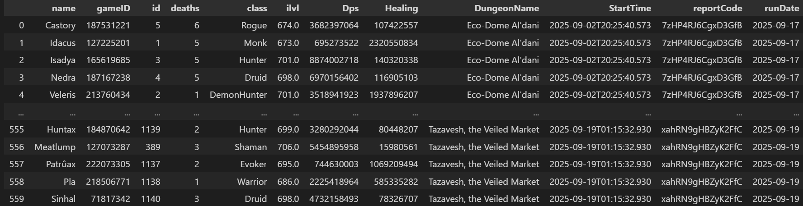

# Warcraftlogs data-gathering

This program connects to the warcraftlogs API to collect data. The data will be saved as separate .parquet files for each run.
The main part is warcraftlogs_get_data.py, when you run this you collect the data. 


Known issues
There are "duplicates" in the data as a result of diffrent users uploading the same fight (The program can't tell when diffrent report codes contain the same fight).

## Preparations

### First: Warcraftlogs authentication
The warcraftlogs API uses OAuth 2.0 for authentication. This means that you have to get yourself a token for authenticating.
Follow the link here for the setup: https://www.warcraftlogs.com/api/docs
The functions in the program will assume there is a .env file where it can find the client_ID, client_secret and WARCRAFTLOGS_TOKEN.
```
client_ID = EXAMPLE123  <-- you enter this (no quotation)
client_secret = EXAMPLE456  <-- you enter this (no quotation)
WARCRAFTLOGS_TOKEN =  <-- The program will enter a string in single quotation here ('example')
```
### Second: Choose user ID's to get reports from
This program gets data from specific users. 

The easiest way to find a user's ID by navigating the warcraftlogs.com website. Go to a report you know the user your intrested in has uploaded. In the upper right corner you will find the users name as a button on a clickdown menu. If you click it there should be a small button for "all reports". The resulting URL will look something like this: https://www.warcraftlogs.com/user/reports-list/XXXXXX <-- this number is the user ID. 

When you have the ID, find where the function named "get_report_codes" is defined (Row 531 at the current iteration). On row 543 it should look like this: 
```user_ids = ['XXXXXX', 'YYYYYY']``` 
Every ID in the list will be used for gathering data, so remove those your not intrested in. 

### Third: Dependencies
Make sure all the dependencies are downloaded. You can se the packages used in the top rows of the file. I recomend using pip.
```pip install EXAMPLE_PACKAGE```


## When running the program

Version 0.5 is only tested for running at most once a day. This is because the data will be saved in a folder with the current day as name. 
During the running the program will make a temporary folder called "RAW_DATA_DIR", if the program runns correctly it will be deleted in the end. In this folder the code stores temporary JSON files that is merged to a larger .parquet file. 

For working with the data there is the file: warcraftlogs_analysis.ipynb
This a jupyter notebook that is handy for working with the data. Use the function look_at_dataset() to initiate a Pandas DataFrame with the data. 


## Deepdive
Here are some explanations of the code that I hope will help whoever uses it but has to make changes.

### Queries
The program uses queries to get data from the API. During a run multiple queries are sent, and for each query sent there are three functions used.

First we have the base query (called make_query()). It uses the token for autherization and sends a text-string (the query) that tells the API what data we want.

The other two functions come in variations, because the are uniqe for each type of data we're getting. They follow these naming conventions:
make_datatype_query()   (exapmle: make_damage_query() or make_report_codes_query())
get_datatype()          (example: get_damage() or get_report_codes())

The make_datatype_query() is responsible for creating the right text-string (the query). 
The get_datatype() is responsible for merging make_query() with the right text-string and then doing some basic datacleaning depending on the datatype. 

### The data


This is what the dataframe will look like when opened. There are duplicates in the data which is a result of diffrent users uploading the same dungeon-run. The program can't tell when diffrent report-codes shows the same fight. This means that when you start doing analysis with the data, you first have to remove all the duplicates. I recomend using a mask that compares DPS, HEALING, Dungeonname and date. 


## Background
The popular game World of Warcraft can be played in many diffrent ways. For groups of five the most popular way is to do "dungeons". 
Most of the users doing dungons aims to do a type of dungeons called "mythic plus". These dungons have a number attached to them, and a higher number means a more difficult dungeon. Only if you complete the dungeon within a timelimit will you be able to enter a more difficult one. 

Users can download "mods" that allows them to save the data from the dungeon and upload it to a website called warcraftlogs. 
Each batch of data is called a "report" (sometimes a "log"), and within each report there can be data for multiple dungeons (or "fights").
The site warcraftlogs has tools for looking at the data and make rankings for how you performed in a dungeon compared to others. 

My goal with this project was to build a tool that allows the user to look at some of the parts that warcraftlogs cares less about: personal performence and how you perform with others. What players have you played the most with? Do you succeed more often with some? What are your highs and lows in respective dungeons?


